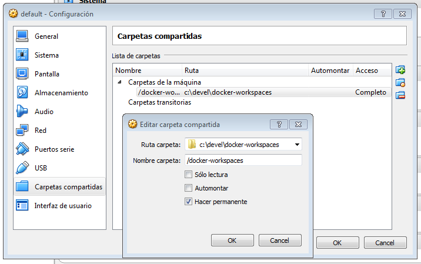

# jenkins-docker

Commands to generate this environment:

to build this images:

	- docker build -t pruebas:1.0 jenkins-data-sample/ "Jenkins data Build image"
	- docker build -t jenkins-app jenkins-master/
	
to run this images:

	- docker run -v /c/Users/jenkins:/var/jenkins_home --name data-jenkins pruebas:1.0 "Jenkins Dir Have to be write permisions to everyone"
	- docker run -p 8080:8080 -p 50000:50000 --volumes-from data-jenkins --name jenkins-app  jenkins-app
	
## Docker Host Configuration
### Master hosts
Any additional configuration is required!
### Slave hosts
Edit your `/var/lib/boot2docker/profile` file, set your `DOCKER_TLS=no` and add the insecure instruction to your extra args. Look at this example:
```
EXTRA_ARGS='
--label provider=virtualbox  --insecure-registry docker-virtual.art.local --inse
cure-registry docker-dev-local2.art.local --insecure-registry docker-prod-local2
.art.local --insecure-registry docker-remote.art.local

'
CACERT=/var/lib/boot2docker/ca.pem
DOCKER_HOST='-H tcp://0.0.0.0:2376'
DOCKER_STORAGE=aufs
DOCKER_TLS=no
SERVERKEY=/var/lib/boot2docker/server-key.pem
SERVERCERT=/var/lib/boot2docker/server.pem
```

After adding the insecure data you may restart your docker host (do it from virtualbox instead of with docker-machine commands).
#### Connections
Add a line like the following to connect with your Artifactory server at `/etc/hosts` file
```
192.168.99.100	docker.art.virtual
```

#### Volumes
To configure the slave hosts it is recommended to mount volumes for storing already downloaded dependencies, such as maven or npm ones.

Follow these steps to create the suitable directories:
```
docker-machine ssh %jenkins-slave-machine%
cd /var/lib
mkdir .m2
mkdir jenkins_workspace
```

Then, remember to add these volumes to your Jenkins docker slaves container.
- maven-image-builder
```
/var/lib/jenkins_workspace:/home/jenkins/workspace
/var/lib/.m2:/home/jenkins/.m2
```
- spa-image-builder
```
/var/lib/jenkins_workspace:/home/jenkins/workspace
```


## Bind shared folders on Virtualbox and boot2docker

The first thing you need to do is to add a shared folder to your VirtualBox. You can use the GUI as the following image:



... or execute the `sharedfolder add boot2docker-vm -name /docker-workspaces -hostpath c:/devel/docker-workspaces` windows command.

After adding the shared folder you need to mount it inside the virtual machine by running:

```
sudo mkdir /docker-workspaces 
sudo mount -t vboxsf /docker-workspaces /docker-workspaces
```


### Permanent shared folder

If you want to permanently add this shared folder you need to create the `/var/lib/boot2docker` file (using `docker-machine ssh`) with this content (lines above without `sudo`)

```
mkdir /docker-workspaces 
mount -t vboxsf /docker-workspaces /docker-workspaces
```


This file will be launched by `/opt/bootscript.sh`. Look at the following snippet:

```
# Allow local HD customisation
if [ -e /var/lib/boot2docker/bootlocal.sh ]; then
   /var/lib/boot2docker/bootlocal.sh > /var/log/bootlocal.log 2>&1 &
fi
```

Reference: [Docker: Permanently Mount a VirtualBox Shared Folder](http:// http://www.developmentalmadness.com/2016/03/05/docker-permanently-mount-a-virtualbox-shared-folder/)

